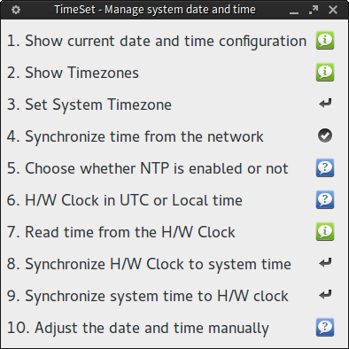

Its a graphical interface written in python for managing system date and time.

## Dependencies

* gksu (for becoming root when running the application from system menu)

* ntp (for synchronising time from the network)

* python-gobject

## Installation

(as root)

<pre>
 # make install
</pre>

For Manjaro Linux users, its available in the Manjaro Linux repository (To check use <i>pacman -Ss timeset-gui</i>).

Available for Arch Linux users in the [AUR](https://aur.archlinux.org/packages/timeset-gui/).

Available for MX Linux 17 users as [mx-timeset-gui](https://github.com/MX-Linux/mx-timeset).

## Usage

(as root)

<pre>
 # timeset-gui
</pre>

## Screenshot

## Links

* https://classicforum.manjaro.org/index.php?topic=7067.0

* https://github.com/aadityabagga/timeset
